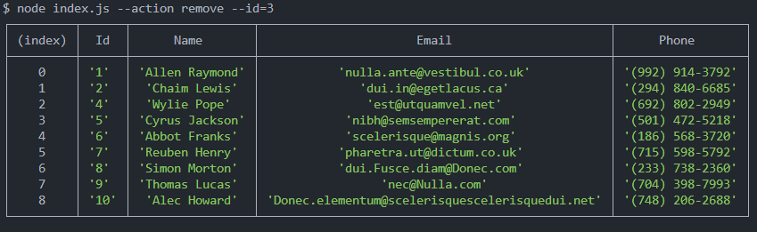

# goit-nodejs-hw-01-cli-application

# Получаем и выводим весь список контактов в виде таблицы (console.table)

node index.js --action list

# Получаем контакт по id

node index.js --action get --id 5

# Добавялем контакт

node index.js --action add --name Mango --email mango@gmail.com --phone 322-22-22

# Удаляем контакт

node index.js --action remove --id=3

